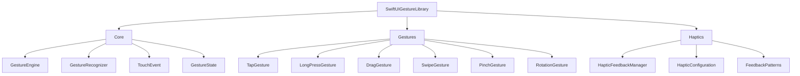

```
 ██████╗ ███████╗███████╗████████╗██╗   ██╗██████╗ ███████╗
██╔════╝ ██╔════╝██╔════╝╚══██╔══╝██║   ██║██╔══██╗██╔════╝
██║  ███╗█████╗  ███████╗   ██║   ██║   ██║██████╔╝█████╗  
██║   ██║██╔══╝  ╚════██║   ██║   ██║   ██║██╔══██╗██╔══╝  
╚██████╔╝███████╗███████║   ██║   ╚██████╔╝██║  ██║███████╗
 ╚═════╝ ╚══════╝╚══════╝   ╚═╝    ╚═════╝ ╚═╝  ╚═╝╚══════╝
```

# SwiftUI Gesture Library

**Production-ready gesture recognition system for SwiftUI with haptic feedback support.**

<p align="center">
  <a href="https://swift.org"></a>
  <a href="https://developer.apple.com/ios/"></a>
  <a href="https://developer.apple.com/macos/"></a>
  <a href="https://developer.apple.com/visionos/"></a>
  <a href="https://swift.org/package-manager/"></a>
  <a href="LICENSE"></a>
  <a href="https://github.com/muhittincamdali/SwiftUI-Gesture-Library/actions"></a>
</p>

---

## Features

- 🎯 **8+ Gesture Types** — Tap, long press, drag, swipe, pinch, rotation, and more
- 📳 **Haptic Feedback** — Integrated feedback system with customizable intensity
- 🔗 **Gesture Composition** — Chain and combine gestures with ease
- ⚡ **High Performance** — Optimized engine with minimal overhead
- 🧩 **Modular Design** — Import only what you need
- 📱 **Cross-Platform** — iOS, macOS, visionOS, watchOS, tvOS

---

## Gesture Showcase

| Gesture | Description | Trigger | Use Case |
|:--------|:------------|:--------|:---------|
| **Tap** | Single touch detection | Finger down + up | Button actions, selection |
| **Double Tap** | Two quick successive taps | 2x tap within 300ms | Zoom, like actions |
| **Long Press** | Press and hold | Hold for duration | Context menus, drag prep |
| **Drag** | Pan with translation tracking | Move while touching | Repositioning, sliders |
| **Swipe** | Quick directional movement | Fast swipe gesture | Navigation, dismiss |
| **Pinch** | Two-finger scale | Spread/pinch fingers | Zoom in/out |
| **Rotation** | Two-finger rotate | Twist fingers | Image rotation |
| **Force Touch** | 3D Touch pressure | Pressure sensitivity | Quick actions |

---

## Architecture



---

## Installation

### Swift Package Manager

Add to your `Package.swift`:

```swift
dependencies: [
    .package(url: "https://github.com/muhittincamdali/SwiftUI-Gesture-Library.git", from: "1.0.0")
]
```

Or in Xcode: **File → Add Package Dependencies** → paste the repository URL.

### Available Modules

```swift
import SwiftUIGestureLibrary       // Full library
import SwiftUIGestureLibraryCore   // Core engine only
import SwiftUIGestureLibraryHaptics // Haptic feedback only
```

---

## Quick Start

### Basic Tap Gesture

```swift
import SwiftUI
import SwiftUIGestureLibrary

struct TapExample: View {
    @State private var tapCount = 0
    
    var body: some View {
        Text("Tapped \(tapCount) times")
            .font(.title)
            .padding(40)
            .background(Color.blue.opacity(0.2))
            .cornerRadius(12)
            .onTapGesture {
                tapCount += 1
            }
    }
}
```

### Long Press with Feedback

```swift
struct LongPressExample: View {
    @State private var isPressed = false
    @StateObject private var haptics = HapticFeedbackManager()
    
    var body: some View {
        Circle()
            .fill(isPressed ? Color.green : Color.blue)
            .frame(width: 120, height: 120)
            .scaleEffect(isPressed ? 1.2 : 1.0)
            .animation(.spring(response: 0.3), value: isPressed)
            .gesture(
                LongPressGesture(minimumDuration: 0.5)
                    .onChanged { _ in
                        isPressed = true
                        haptics.triggerFeedback(for: .longPress)
                    }
                    .onEnded { _ in
                        isPressed = false
                    }
            )
    }
}
```

### Draggable Card

```swift
struct DraggableCard: View {
    @State private var offset: CGSize = .zero
    @State private var isDragging = false
    
    var body: some View {
        RoundedRectangle(cornerRadius: 20)
            .fill(
                LinearGradient(
                    colors: [.purple, .blue],
                    startPoint: .topLeading,
                    endPoint: .bottomTrailing
                )
            )
            .frame(width: 200, height: 150)
            .shadow(radius: isDragging ? 20 : 10)
            .offset(offset)
            .gesture(
                DragGesture()
                    .onChanged { value in
                        offset = value.translation
                        isDragging = true
                    }
                    .onEnded { value in
                        withAnimation(.spring(response: 0.4, dampingFraction: 0.6)) {
                            offset = .zero
                            isDragging = false
                        }
                    }
            )
    }
}
```

### Pinch to Zoom

```swift
struct ZoomableImage: View {
    @State private var scale: CGFloat = 1.0
    @State private var lastScale: CGFloat = 1.0
    
    var body: some View {
        Image("photo")
            .resizable()
            .scaledToFit()
            .scaleEffect(scale)
            .gesture(
                MagnificationGesture()
                    .onChanged { value in
                        scale = lastScale * value
                    }
                    .onEnded { _ in
                        lastScale = scale
                        // Clamp scale between 1x and 4x
                        withAnimation {
                            scale = min(max(scale, 1.0), 4.0)
                            lastScale = scale
                        }
                    }
            )
    }
}
```

### Rotation Gesture

```swift
struct RotatableView: View {
    @State private var angle: Angle = .zero
    @State private var lastAngle: Angle = .zero
    
    var body: some View {
        Image(systemName: "arrow.up.circle.fill")
            .font(.system(size: 100))
            .foregroundColor(.orange)
            .rotationEffect(angle)
            .gesture(
                RotationGesture()
                    .onChanged { value in
                        angle = lastAngle + value
                    }
                    .onEnded { _ in
                        lastAngle = angle
                    }
            )
    }
}
```

### Swipe to Dismiss

```swift
struct SwipeCard: View {
    @State private var offset: CGFloat = 0
    @State private var opacity: Double = 1.0
    
    var body: some View {
        CardContent()
            .offset(x: offset)
            .opacity(opacity)
            .gesture(
                DragGesture()
                    .onChanged { value in
                        offset = value.translation.width
                        opacity = 1.0 - abs(Double(offset) / 300)
                    }
                    .onEnded { value in
                        let threshold: CGFloat = 150
                        if abs(value.translation.width) > threshold {
                            // Dismiss
                            withAnimation(.easeOut(duration: 0.2)) {
                                offset = value.translation.width > 0 ? 500 : -500
                                opacity = 0
                            }
                        } else {
                            // Snap back
                            withAnimation(.spring()) {
                                offset = 0
                                opacity = 1.0
                            }
                        }
                    }
            )
    }
}
```

---

## Combining Gestures

### Simultaneous Gestures

Apply multiple gestures at once:

```swift
struct TransformableView: View {
    @State private var scale: CGFloat = 1.0
    @State private var angle: Angle = .zero
    @State private var offset: CGSize = .zero
    
    var body: some View {
        Image("photo")
            .resizable()
            .scaledToFit()
            .scaleEffect(scale)
            .rotationEffect(angle)
            .offset(offset)
            .gesture(
                SimultaneousGesture(
                    SimultaneousGesture(
                        MagnificationGesture()
                            .onChanged { scale = $0 },
                        RotationGesture()
                            .onChanged { angle = $0 }
                    ),
                    DragGesture()
                        .onChanged { offset = $0.translation }
                )
            )
    }
}
```

### Sequential Gestures

Chain gestures in sequence:

```swift
struct SequentialExample: View {
    @State private var isDragging = false
    @State private var offset: CGSize = .zero
    
    var body: some View {
        Circle()
            .fill(isDragging ? Color.red : Color.blue)
            .frame(width: 100, height: 100)
            .offset(offset)
            .gesture(
                SequenceGesture(
                    LongPressGesture(minimumDuration: 0.3),
                    DragGesture()
                )
                .onChanged { value in
                    switch value {
                    case .first(true):
                        isDragging = true
                    case .second(_, let drag):
                        offset = drag?.translation ?? .zero
                    default:
                        break
                    }
                }
                .onEnded { _ in
                    withAnimation {
                        isDragging = false
                        offset = .zero
                    }
                }
            )
    }
}
```

### Exclusive Gestures

One gesture takes priority:

```swift
struct ExclusiveExample: View {
    var body: some View {
        Rectangle()
            .fill(Color.green)
            .frame(width: 200, height: 200)
            .gesture(
                ExclusiveGesture(
                    LongPressGesture(minimumDuration: 1.0)
                        .onEnded { _ in print("Long pressed!") },
                    TapGesture()
                        .onEnded { print("Tapped!") }
                )
            )
    }
}
```

---

## Haptic Feedback

### HapticFeedbackManager

The library includes a powerful haptic feedback system:

```swift
import SwiftUIGestureLibraryHaptics

// Initialize with default configuration
let haptics = HapticFeedbackManager()

// Or customize
let customHaptics = HapticFeedbackManager(
    configuration: HapticConfiguration(
        defaultIntensity: 0.8,
        enableAdvancedHaptics: true,
        enableCustomPatterns: true,
        autoResetEngine: true
    )
)
```

### Gesture-Specific Feedback

```swift
// Trigger feedback for specific gesture types
haptics.triggerFeedback(for: .tap)        // Light impact
haptics.triggerFeedback(for: .doubleTap)  // Double pulse
haptics.triggerFeedback(for: .longPress)  // Heavy impact
haptics.triggerFeedback(for: .swipe)      // Rigid impact
haptics.triggerFeedback(for: .pan)        // Soft impact
haptics.triggerFeedback(for: .pinch)      // Medium impact
haptics.triggerFeedback(for: .rotation)   // Rigid impact
```

### Custom Intensity

```swift
// Set global intensity (0.0 - 1.0)
haptics.setIntensity(0.7)

// Trigger with specific intensity
haptics.triggerCustomFeedback(intensity: 0.5)

// Enable/disable haptics
haptics.setEnabled(false)
```

### Integration Example

```swift
struct HapticButton: View {
    @StateObject private var haptics = HapticFeedbackManager()
    @State private var isPressed = false
    
    var body: some View {
        Button {
            haptics.triggerFeedback(for: .tap)
            // Action
        } label: {
            Text("Tap Me")
                .padding()
                .background(Color.blue)
                .foregroundColor(.white)
                .cornerRadius(10)
        }
        .simultaneousGesture(
            LongPressGesture(minimumDuration: 0.5)
                .onChanged { _ in
                    haptics.triggerFeedback(for: .longPress)
                    isPressed = true
                }
        )
    }
}
```

---

## Custom View Modifiers

### Swipe Direction Modifier

```swift
extension View {
    func onSwipe(
        direction: SwipeDirection,
        threshold: CGFloat = 50,
        action: @escaping () -> Void
    ) -> some View {
        self.gesture(
            DragGesture(minimumDistance: threshold)
                .onEnded { value in
                    let horizontal = value.translation.width
                    let vertical = value.translation.height
                    
                    switch direction {
                    case .left where horizontal < 0 && abs(horizontal) > abs(vertical):
                        action()
                    case .right where horizontal > 0 && abs(horizontal) > abs(vertical):
                        action()
                    case .up where vertical < 0 && abs(vertical) > abs(horizontal):
                        action()
                    case .down where vertical > 0 && abs(vertical) > abs(horizontal):
                        action()
                    }
                }
        )
    }
}

enum SwipeDirection {
    case left, right, up, down
}

// Usage
Text("Swipe me!")
    .onSwipe(direction: .left) {
        print("Swiped left")
    }
```

### Double Tap to Zoom

```swift
extension View {
    func doubleTapToZoom(scale: Binding<CGFloat>) -> some View {
        self.onTapGesture(count: 2) {
            withAnimation(.spring()) {
                scale.wrappedValue = scale.wrappedValue > 1 ? 1 : 2
            }
        }
    }
}

// Usage
Image("photo")
    .scaleEffect(scale)
    .doubleTapToZoom(scale: $scale)
```

---

## Project Structure

```
SwiftUI-Gesture-Library/
├── Sources/
│   ├── Core/
│   │   ├── GestureEngine.swift
│   │   ├── GestureRecognizer.swift
│   │   ├── GestureState.swift
│   │   ├── GestureType.swift
│   │   └── TouchEvent.swift
│   ├── Gestures/
│   │   ├── TapGestureHandler.swift
│   │   ├── LongPressHandler.swift
│   │   ├── DragGestureHandler.swift
│   │   ├── SwipeGestureHandler.swift
│   │   ├── PinchGestureHandler.swift
│   │   └── RotationGestureHandler.swift
│   └── Haptics/
│       ├── HapticFeedbackManager.swift
│       ├── HapticConfiguration.swift
│       └── FeedbackPatterns.swift
├── Examples/
│   ├── BasicExamples/
│   ├── AdvancedExamples/
│   └── CustomGesturesExamples/
├── Tests/
│   ├── UnitTests/
│   ├── IntegrationTests/
│   └── UITests/
└── Documentation/
```

---

## Requirements

| Platform | Minimum Version |
|:---------|:----------------|
| iOS | 17.0+ |
| macOS | 14.0+ |
| visionOS | 1.0+ |
| watchOS | 10.0+ |
| tvOS | 17.0+ |
| Xcode | 15.0+ |
| Swift | 5.9+ |

---

## Documentation

Full documentation available in the [Documentation](Documentation/) folder:

- [Gesture Types Guide](Documentation/GestureTypes.md)
- [Combining Gestures](Documentation/CombiningGestures.md)
- [Custom Gesture Creation](Documentation/CustomGestures.md)
- [Haptic Feedback Guide](Documentation/HapticFeedback.md)
- [Performance Optimization](Documentation/Performance.md)
- [Migration Guide](Documentation/Migration.md)

---

## Contributing

Contributions are welcome! Please read [CONTRIBUTING.md](CONTRIBUTING.md) before submitting PRs.

1. Fork the repository
2. Create your feature branch (`git checkout -b feature/amazing-feature`)
3. Commit your changes (`git commit -m 'feat: add amazing feature'`)
4. Push to the branch (`git push origin feature/amazing-feature`)
5. Open a Pull Request

---

## License

This project is licensed under the MIT License - see the [LICENSE](LICENSE) file for details.

---

## Author

**Muhittin Camdali** — [@muhittincamdali](https://github.com/muhittincamdali)

---

<p align="center">
  <sub>Built with ❤️ for the SwiftUI community</sub>
</p>
